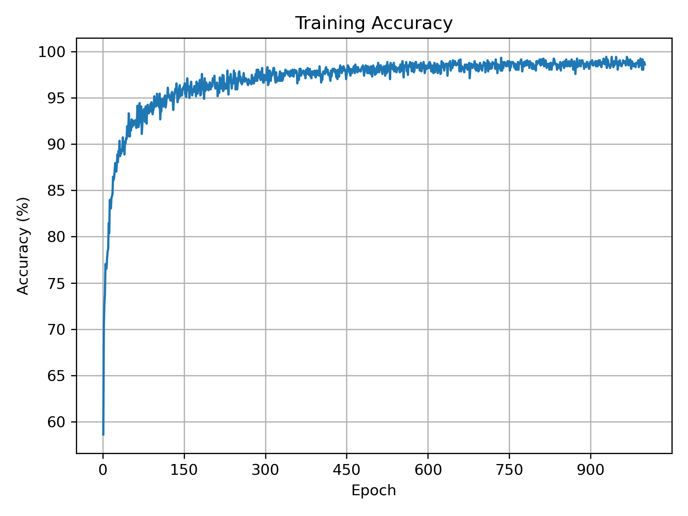
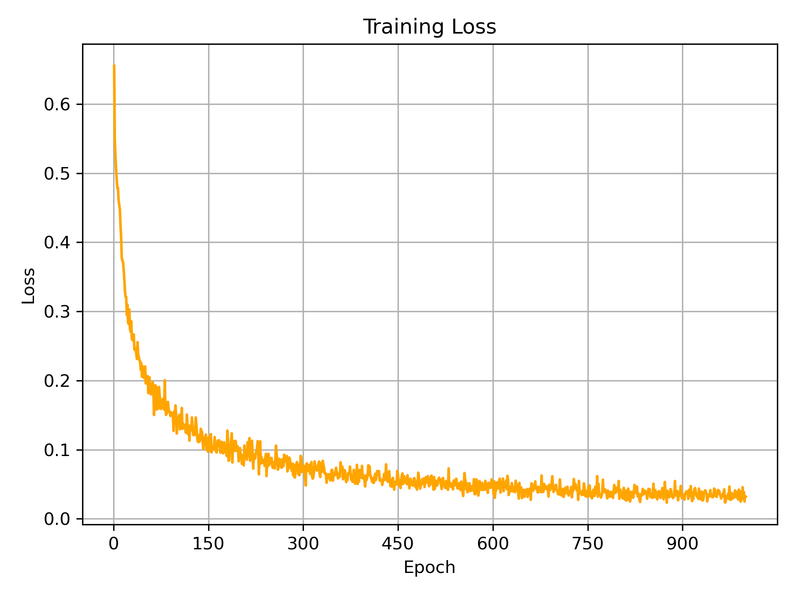
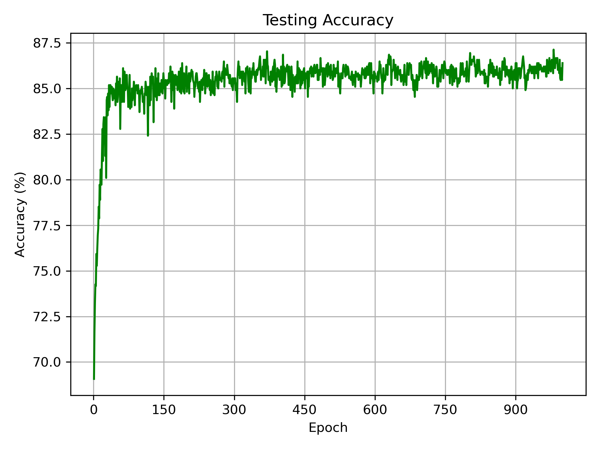
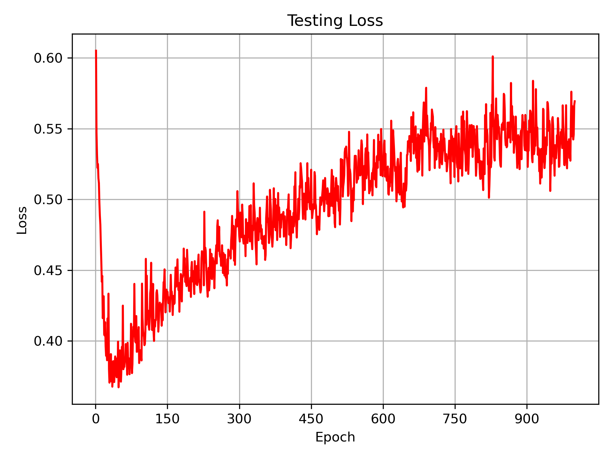

# LAB2
EEG Classification with BCI competition dataset

## Datasets
The training and testing data in BCI Competition III – IIIb.

---

## 📁 Project Structure
```
LAB2/
│
├── models/              # EEGNet and DeepConvNet
│    ├── model_ELU.py
│    ├── model_ReLU.py
│    └── model_LeakyReLU.py
│
├── data_LAB2/           # Datasets
│    ├── S4b_train.npz
│    ├── S4b_test.npz
│    ├── X11b_train.npz
│    └── X11b_test.npz
│ 
├── dataloader.py        # Load data
├── EEGNet_main.py       # Run EEGNet
├── DeepConvNet_main.py  # Run DeepConvNet
│
├── plots_LAB2/          # Accuracy and Loss curves
├── pts_LAB2/            # Trained model weights (.pt)
└── Source/              
```
---
## Code EEGNet_main.py and DeepConvNet_main.py
For EEGNet model:
- EEGNet_main.py

For DeepConvNet model:
- DeepConvNet_main.py
```
#You could change # to use different `Activation Function` directly.

# EEGNet
from models.model_ELU import EEGNet
#from models.model_ReLU import EEGNet
#from models.model_LeakyReLU import EEGNet

# DeepConvNet
from models.model_ELU import DeepConvNet
#from models.model_ReLU import DeepConvNet
#from models.model_LeakyReLU import DeepConvNet
```
---

## Results
### Hyper Parameters - Set1
- **Batch size:** `64`  
- **Learning rate:** `1e-2`  
- **Epochs:** `150`  
- **Optimizer:** `Adam`  
- **Loss function:** `torch.nn.CrossEntropyLoss()`  
- **Activation function:** `ELU()`
###  Accuracy under Hyper Parameters - Set 1
| Activation Function |  EEGNet  | DeepConvNet |
|:--------------------:|:----------:|:------------:|
| **ELU**        | 85.93% | 81.11% |
### Hyper Parameters - Set2
- **Batch size:** `64`  
- **Learning rate:** `1e-3` (EEGNet) / `1e-4` (DeepConvNet)
- **Epochs:** `1000` (EEGNet) / `3000` (DeepConvNet) 
- **Optimizer:** `Adam`  
- **Loss function:** `torch.nn.CrossEntropyLoss()`  
- **Activation function:** `ELU()` / `ReLU()` / `LeakyReLU()`
### Accuracy under Hyper Parameters - Set 2

| Activation Function |   EEGNet   | DeepConvNet |
|:--------------------:|:----------:|:------------:|
| **ELU**             | **87.13%** |   82.59% |
| **ReLU**        | **87.13%** |   83.15% |
| **LeakyReLU**              |   86.39%   |   82.22% |
---
##Curve
### Accuracy under Hyper Parameters - Set 2
<div style="display: flex; flex-wrap: wrap; gap: 10px;">
  
  
  
  
</div>

### Accuracy under Hyper Parameters - Set 2
<div style="display: flex; flex-wrap: wrap; gap: 10px;">
  
  
  
  
</div>


